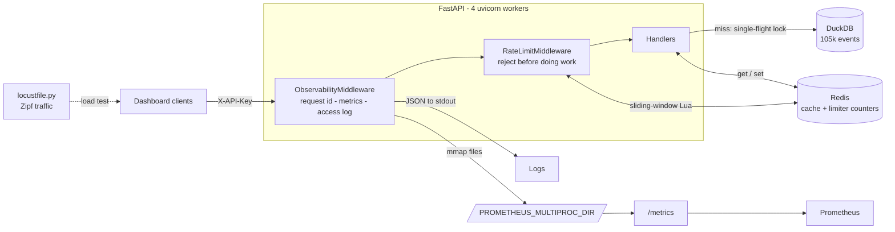

# Observable API

> A read-heavy cohort-analytics API built to be operated: per-client rate limiting, a
> single-flight response cache, correlated JSON logs, Prometheus metrics, and a load test
> that produces every number below.

[](https://github.com/Prithv122/observable-api/actions/workflows/ci.yml)

**Live demo:** not deployed — runs locally via `docker compose up --build` (see §6).
The deliverable here is the operational behaviour under load, which a free-tier host that
sleeps after 15 minutes cannot demonstrate.
**Stack:** FastAPI · Redis 8 · DuckDB · structlog · prometheus-client · Locust · Docker Compose

---

## 1. The problem

An internal analytics API serves cohort retention and funnel metrics to dashboards. Read
traffic is heavy, bursty, and extremely skewed — everyone opens the same three recent
cohorts, and the underlying query is an aggregation over an event table, not a primary-key
lookup. Two things go wrong in that situation and both are operational rather than
functional: one badly-written dashboard on a polling loop can saturate the service for
everyone, and when latency degrades nobody can tell whether the database got slower or the
cache stopped working.

This service answers both. It stays up under a client that will not stop asking, and when
something does degrade, the metrics say *which* thing degraded.

## 2. The data

| | |
|---|---|
| Source | **Synthetic**, generated in-repo by `src/observableapi/warehouse.py` |
| Size | 105,638 events · 21,600 users · 24 weekly cohorts (2026-01-05 → 2026-06-15) · 2.5 MB DuckDB file |
| Licence | n/a — generated, MIT along with the rest of the repo |
| Refresh | `uv run observable-api build`, deterministic under `SEED = 20260907` |

**The data is synthetic, so every number in §5 is a measurement of this service's
behaviour, not a claim about any real business's retention.** No public dataset publishes
raw user-level signup/activation/subscription events, and this project is about serving an
analytical read workload under load rather than about the analysis itself. What the
generator does provide is a query with realistic *shape* — a `COUNT(DISTINCT …)`
aggregation over ~100k rows that takes tens of milliseconds, which is what makes the cache
worth measuring at all.

Two behaviours are planted deliberately:

- **Skewed cohort popularity** in the load profile (Zipf, s=1.1): the newest cohort takes
  ~30% of requests, the oldest twelve share ~15%. A cache benchmarked against uniformly
  random keys measures nothing.
- **Users who subscribe without activating**, so the funnel is not strictly nested — the
  case naive funnel SQL silently drops.

## 3. Architecture



Request path: every request gets a request id and is timed; the limiter checks the client's
budget in one Lua call and rejects before any work happens; the handler asks the cache,
which either returns a hit or takes a short lock and runs the DuckDB aggregation in the
threadpool.

## 4. Key decisions & tradeoffs

| Decision | Chose | Over | Why |
|---|---|---|---|
| Rate-limit algorithm | Weighted sliding-window counter | Fixed window | A fixed window allows a client to spend its whole budget just before the boundary and again just after — 2× the limit in a moment. `test_fixed_window_boundary_burst_is_rejected` demonstrates the limiter refusing exactly that, rather than asserting it in a comment. |
| | | Sliding-window log | Exact, but stores one sorted-set member per request: memory grows with traffic, and the client being throttled hardest costs the most to store. The weighted counter is two integers per client at any volume. |
| Limiter state | Redis + Lua | In-process dict | With 4 workers an in-process counter gives each worker its own budget, so the real limit is 4× what you configured. `test_rate_limit_is_shared_across_app_instances` fails if anyone ever "simplifies" it back. |
| Limiter clock | `redis.call('TIME')` inside the script | Timestamp from Python | One clock for all workers. With each worker using its own clock, a second of skew puts requests in different buckets and the limit quietly becomes wrong — under exactly the multi-worker deployment that made a shared limiter necessary. |
| Cache on miss | Single-flight lock | Plain check-compute-store | When a hot key expires with 50 requests in flight, all 50 miss and all 50 run the same aggregation. The stampede lands hardest on the most popular key. Measured: 60,519 lookups produced 586 misses and 76 coalesced waits. |
| Cache failure mode | Fail open | Fail closed | A cache that can take the API down has *lowered* availability. Every Redis error path falls through to computing the value; the `error` label on `cache_operations_total` makes the degradation visible instead of silent. |
| Metric labels | Route template | Raw URL path | `/cohorts/2026-01-05/retention` as a label means one time series per cohort, forever. Labels here are the route pattern, a fixed small set — including on 429s, which are the responses you most want broken down by route. |
| Metrics under 4 workers | `prometheus_client` multiprocess mode | Per-process registry | Each worker holds its own counters and a scrape is answered by whichever worker gets the connection. Consecutive scrapes of the same counter returned **97 and then 74**. With mmap-backed aggregation, Prometheus's throttled count (26,271) now matches Locust's independent 429 count exactly. |
| Instrumentation | Hand-rolled collectors | `prometheus-fastapi-instrumentator` | The `cache` label on the latency histogram is the whole point: it separates "requests got slower" from "the hit rate dropped". No generic instrumentator knows about this application's cache. |
| DuckDB access | `.cursor()` per query, in the threadpool | One shared connection | DuckDB connections are not thread-safe, and it is synchronous and CPU-bound — calling it on the event loop would block every other in-flight request for the length of the aggregation. |
| Warehouse loading | CSV + `COPY` | `executemany` | Measured at **6.5 ms per row** (15.8 s for a 2,412-row fixture): the default warehouse would take ~11.5 minutes to build. The same 105,638 rows through `COPY` land in **0.23 s**. |

## 5. Results

Measured on the stack in this repo — Docker Desktop on Windows 11, Intel i7-8850H (12
logical CPUs allocated to Docker, 31 GB), API at 4 uvicorn workers, Redis 8, 60 concurrent
Locust clients with no think time for 120 s per scenario. Reproduce with
`uv run python scripts/benchmark.py`; raw Locust CSVs are committed under `loadtest/`.

| Scenario | RPS | p50 | p95 | p99 | max | Requests | Cache hit rate | 429s |
|---|---|---|---|---|---|---|---|---|
| Cache off (baseline) | 188 | 260 ms | 660 ms | 950 ms | 2,494 ms | 22,340 | 0.0% | 0 |
| **Cache on, 30 s TTL** | **508** | **90 ms** | **160 ms** | **240 ms** | 443 ms | 60,327 | 99.0% | 0 |
| Cache on + rate limit 60/min | 299 | 160 ms | 300 ms | 420 ms | 717 ms | 35,658 | 95.1% | 26,271 |

**Caching: 2.7× the throughput, and p95 latency 4.1× lower** (660 ms → 160 ms) at a 99.0%
hit rate on Zipf-distributed traffic.

Isolating the cache from queueing effects — one request at a time against an idle server,
30 samples each, alternating a flushed and a warm cache:

| | median | p95 |
|---|---|---|
| Cold (DuckDB aggregation) | 34.0 ms | 43.9 ms |
| Warm (Redis hit) | 9.5 ms | 26.1 ms |

Three things worth stating plainly rather than dressing up:

- **The third row's latency figures are not comparable to the other two.** 73.7% of those
  requests were 429s, and rejecting a request is much cheaper than serving it. Its lower
  throughput than row 2 (299 vs 508 RPS) is the limiter's cost: one extra Redis round trip
  on *every* request, throttled or not, which is expensive over Docker Desktop's network
  stack. The row is here to show the limiter working under load, not to compare latency.
- **Absolute numbers on this hardware are noisy.** Baseline throughput measured 162, 170
  and 213 RPS across three 60-second runs, and 188 in the 120-second run reported above.
  The longer run length was chosen because of that spread; the ratios held across every
  run, the absolute figures did not.
- **The warm-hit median of 9.5 ms is mostly not Redis.** It is HTTP plus Docker Desktop's
  Windows networking; Redis itself is a sub-millisecond round trip. The honest claim is the
  *difference* — the DuckDB aggregation costs ~24 ms that the cache removes.

Correctness, not performance:

- **68 tests, 100% statement coverage**, run against a real Redis — never a mock, because
  every interesting property (atomic check-and-increment, compare-and-delete lock release,
  `TIME` inside a script, TTL behaviour) lives in Lua inside Redis.
- Prometheus's throttled count and Locust's independently-counted 429s agree exactly
  (26,271), which is what proves the multiprocess metrics fix.

## 6. How to run

```bash
git clone https://github.com/Prithv122/observable-api.git
cd observable-api
docker compose up --build
```

That is the whole thing — API on :8000, Redis on :6379, Prometheus on :9090. No `.env`
needed; the compose file supplies defaults, and the warehouse is generated into the image at
build time.

```bash
curl localhost:8000/healthz
curl localhost:8000/cohorts
curl localhost:8000/cohorts/2026-01-05/retention
curl "localhost:8000/cohorts/2026-01-05/funnel?channel=paid_search"
curl localhost:8000/metrics
```

Interactive docs at <http://localhost:8000/docs>. Prometheus at <http://localhost:9090>
(try `rate(http_requests_total[1m])`, or
`histogram_quantile(0.95, sum by (le, cache) (rate(http_request_duration_seconds_bucket[1m])))`
to see hit and miss latency separately).

Watch the rate limiter (default 60 requests/minute per client):

```bash
for i in $(seq 1 70); do curl -s -o /dev/null -w "%{http_code} " localhost:8000/cohorts; done
```

### Running the tests

Tests need a Redis on port 6380 (kept off 6379 so it never collides with the compose stack):

```bash
docker run -d --rm -p 6380:6379 redis:8-alpine
uv sync --all-groups
uv run pytest
```

On Windows, `tmp_path` fixtures need an explicit base directory:
`uv run pytest --basetemp=.pytest-tmp`.

### Reproducing the benchmark

```bash
uv run python scripts/benchmark.py
```

Takes about 8 minutes: it recreates the API container per scenario, flushes Redis between
runs so none inherits a warm cache, drives Locust headless, and writes CSVs plus
`summary.json` to `loadtest/`.

### Without Docker

```bash
uv sync --all-groups
uv run observable-api build      # generates data/warehouse.duckdb
uv run observable-api serve      # http://127.0.0.1:8000
```

Needs a Redis reachable at `REDIS_URL` (default `redis://localhost:6379/0`). Configuration
is in `.env.example`.

## 7. What I'd change at 100× scale

At 100× the traffic (~50k RPS) and 100× the data (~10M events), the parts that break, in the
order they break:

1. **DuckDB is embedded, so every replica holds its own copy of the file.** It is excellent
   at this query shape and would still be fine at 10M rows, but a warehouse that must be
   rebuilt and redeployed to change is not a data platform. First move: DuckDB reading
   Parquet from object storage, so the data is refreshed independently of the deployment;
   beyond that, a real columnar warehouse (ClickHouse) with the API as a thin caching layer.
2. **The threadpool becomes the bottleneck before the CPU does.** Every cache miss occupies
   a thread for the length of an aggregation, so a burst of misses across many cold keys
   saturates the pool while the event loop sits idle. Fix: a bounded semaphore around
   warehouse queries with a fast 503 when it is full — shed load deliberately rather than
   queueing until everything times out.
3. **A 30-second TTL on 100× the key space stops being a cache.** With enough distinct
   cohort/channel combinations the hit rate collapses. Fix: precompute the hot aggregations
   on a schedule and serve them from Redis with a long TTL, keeping the on-demand path only
   for the long tail — the cache stops being a side effect of traffic and becomes a
   materialised view.
4. **Redis becomes a single point of contention** — every request makes at least one round
   trip for the limiter and one for the cache. Fix: pipeline the two into a single call, and
   shard by client id (the limiter keys are already hash-tagged for exactly this).
5. **Metric cardinality.** The route-template discipline holds at any scale, but the
   multiprocess mmap directory does not survive containers that restart often — at that
   point the collector belongs beside the app (an OpenTelemetry collector sidecar) rather
   than inside it.

What I would *not* change: rate limiting and caching stay in the application rather than
moving to an API gateway. Both need to know things the gateway does not — which responses
are cacheable per-cohort, and what a *user's* budget is rather than an IP's.

---

## References

- Cloudflare, ["How we built rate limiting capable of scaling to millions of domains"](https://blog.cloudflare.com/counting-things-a-lot-of-different-things/)
  — the weighted sliding-window counter approximation used in `ratelimit.py`.
- [`prometheus_client` multiprocess mode documentation](https://prometheus.github.io/client_python/multiprocess/)
  — the mmap-directory approach behind `exposition_registry`.
- [Prometheus naming and label conventions](https://prometheus.io/docs/practices/naming/),
  and the RED method (rate, errors, duration) for the choice of what to measure.
- DuckDB docs on [bulk loading](https://duckdb.org/docs/stable/data/insert) — the `COPY`
  versus row-at-a-time `INSERT` difference measured in §4.
